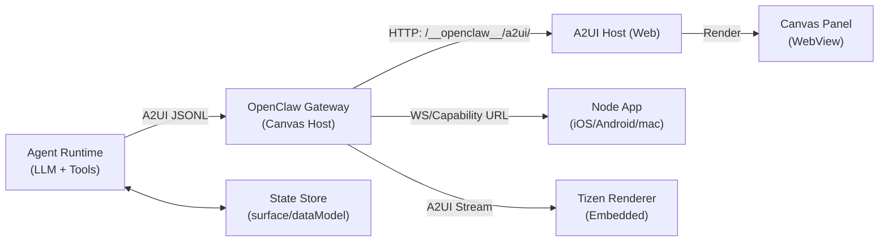
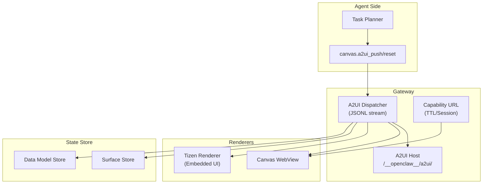
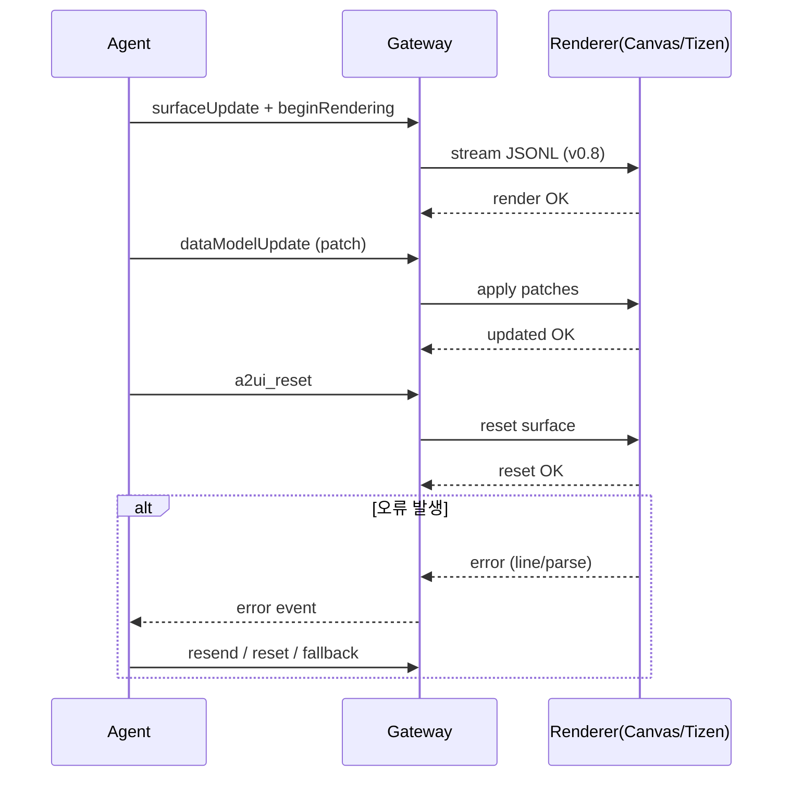
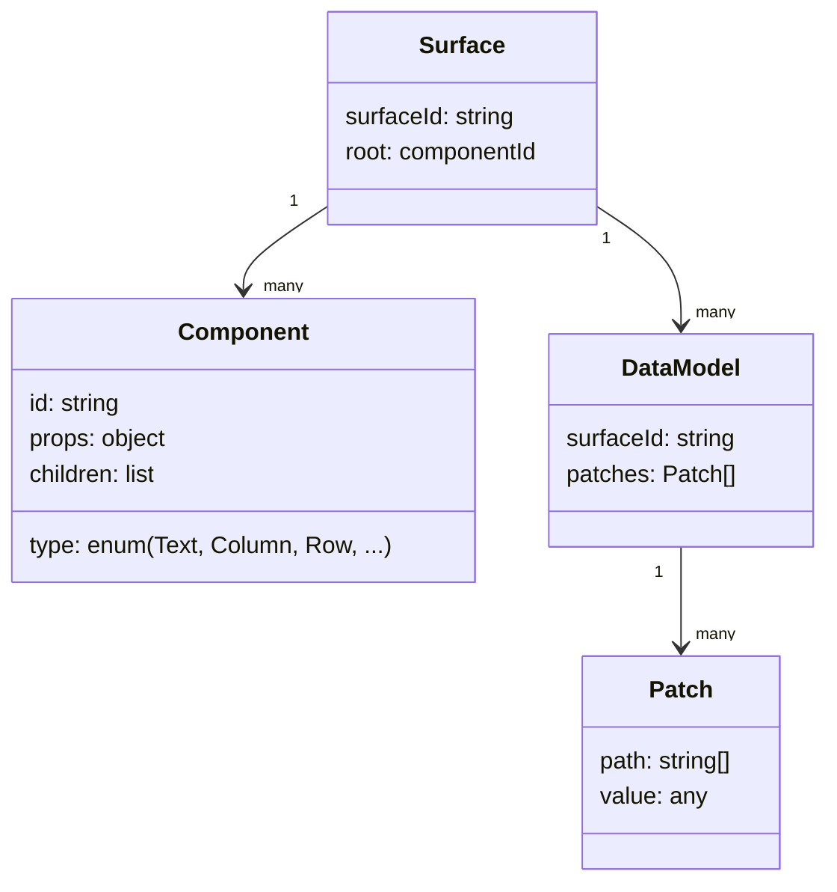
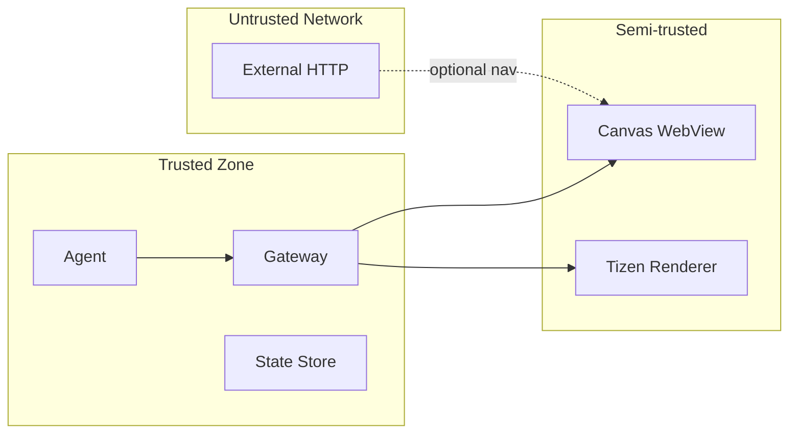

# A2UI 아키텍처 상세 분석 (OpenClaw + Tizen Renderer)

> 범위: OpenClaw A2UI(v0.8) + Tizen Renderer 관점의 전체 구조/흐름/데이터 모델/보안 경계

## 1) 시스템 컨텍스트

## 2) 컴포넌트 구조

## 3) 시퀀스 (초기 렌더/업데이트/리셋/오류복구)

## 4) 데이터 모델

핵심은 `surfaceId` 단위 상태 관리다.
- `surfaceUpdate`: 컴포넌트 트리 정의/갱신
- `beginRendering`: 루트 렌더 시작
- `dataModelUpdate`: 패치 기반 부분 업데이트
- `deleteSurface`: surface 제거

## 5) 운영/보안 경계

보안 권장사항:
- 기본 loopback 바인딩
- 외부 노출 시 인증/프록시 신뢰 설정
- capability URL TTL/세션 제한
- 입력 JSONL 라인 검증 필수

## 6) 참고
- OpenClaw Canvas/A2UI: https://docs.openclaw.ai/platforms/mac/canvas
- Gateway config reference: https://docs.openclaw.ai/gateway/configuration-reference
