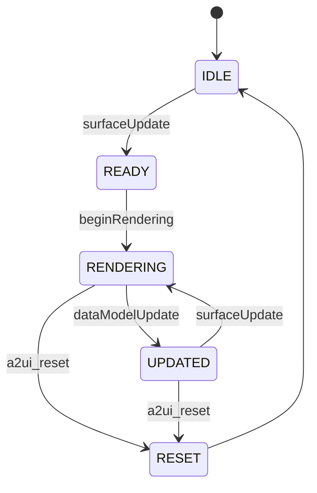
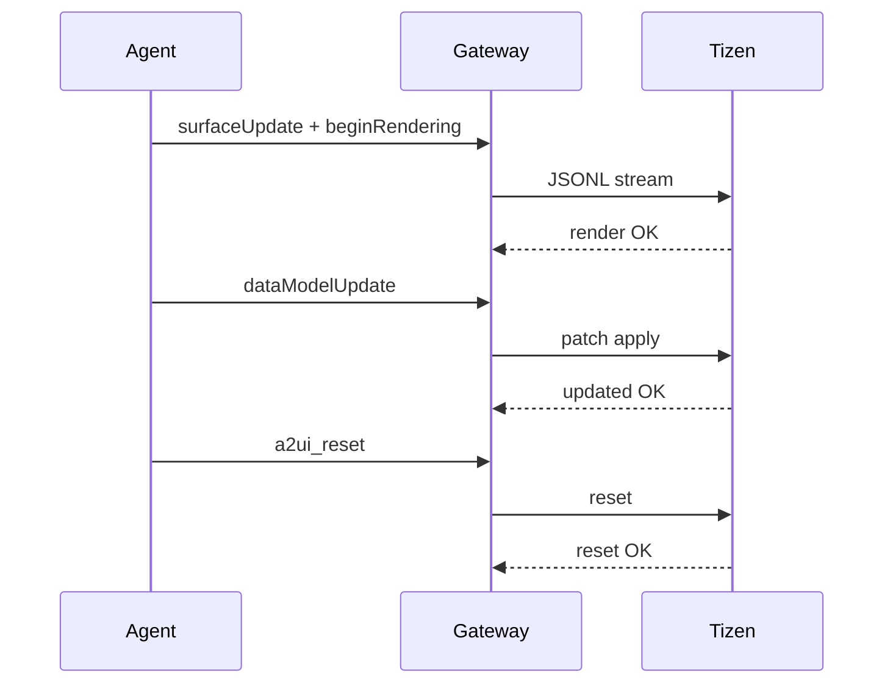

# PRD: A2UI Tizen Renderer

작성일: 2026-02-27  
버전: v1.0 (Draft)

## 1. 문제 정의
OpenClaw의 A2UI는 Canvas(WebView) 기반에 최적화되어 있으나, Tizen 환경에서 동일한 UI 브리지(구조적 렌더링)를 제공하는 렌더러가 없다. 이로 인해 TV/임베디드 대상의 에이전트 UX 일관성이 깨지고, 운영 화면/업무 화면의 재사용성이 낮아진다.

## 2. 목표 / 비목표
### 목표
- A2UI v0.8 메시지를 Tizen에서 네이티브/경량 렌더링
- `surfaceUpdate`, `beginRendering`, `dataModelUpdate`, `deleteSurface`, `reset` 지원
- Canvas와 동일한 의미론적 동작 보장

### 비목표
- v0.9 완전 지원(준비만)
- 임의 HTML/JS 실행 엔진 제공

## 3. 사용자 및 유즈케이스
- 운영자: 실시간 상태판/작업 진행률 모니터링
- 현장 사용자: 키오스크/사이니지에서 워크플로우 확인
- 개발자: 동일 A2UI 페이로드로 다중 타깃(Canvas/Tizen) 재사용

## 4. 기능 요구사항 (FR)
FR-01. A2UI v0.8 JSONL 파싱
FR-02. `surfaceUpdate` 처리
FR-03. `beginRendering` 처리
FR-04. `dataModelUpdate` 처리
FR-05. `deleteSurface` 처리
FR-06. `a2ui_reset` 처리
FR-07. 다중 surfaceId 동시 관리
FR-08. JSONL line 단위 에러 리포팅
FR-09. 기본 컴포넌트(Text/Column/Row) 렌더링
FR-10. 스타일 최소 지원(정렬/간격/폰트 크기)
FR-11. 해상도/비율 대응(Scaling)
FR-12. 렌더링 상태 로그 수집
FR-13. 재연결 시 상태 복구
FR-14. 성능 메트릭 수집(초기 렌더/업데이트)
FR-15. 미지원 버전 메시지 감지 및 graceful fail

## 5. 비기능 요구사항 (NFR)
- NFR-Perf-01: 초기 렌더 500ms 이내(중간 복잡도 UI 기준)
- NFR-Perf-02: 부분 업데이트 200ms 이내
- NFR-Reliability-01: 24시간 soak test 통과
- NFR-Sec-01: 외부 스크립트 실행 금지
- NFR-Sec-02: 입력 검증 실패 시 안전 중단
- NFR-Compat-01: v0.8 100% 의미 호환
- NFR-Compat-02: v0.9 수신 시 경고+무시

## 6. 프로토콜 호환 전략
- Phase 1: v0.8 고정 지원
- Phase 2: 버전 어댑터 레이어 도입
- 정책: `UNSUPPORTED_VERSION` 경고 후 처리 중단(크래시 금지)

## 7. API/인터페이스 초안
외부 입력(예시):
```http
POST /a2ui/stream
Content-Type: application/x-ndjson
Body: <JSONL>
```

응답(예시):
- 200 Applied
- 400 InvalidLine
- 409 SurfaceNotFound
- 422 UnsupportedVersion

내부 인터페이스:
```text
applySurfaceUpdate(surfaceId, components[])
beginRendering(surfaceId, rootId)
applyDataModelPatch(surfaceId, patches[])
deleteSurface(surfaceId)
resetSurface(surfaceId?)
```

## 8. 상태기계


## 9. 에러코드
- E_PARSE_LINE
- E_UNSUPPORTED_VERSION
- E_SURFACE_NOT_FOUND
- E_COMPONENT_MISSING
- E_RENDER_FAIL
- E_RESET_FAIL

## 10. 테스트 전략
### Unit
- 파서 라인 검증
- patch 적용 로직
- 컴포넌트 매핑

### Integration
- Gateway→Renderer 스트림 처리
- reset/reconnect 동작

### E2E
- 실제 Tizen 디바이스 렌더
- 24시간 안정성/메모리 검증
- 고빈도 업데이트(초당 N회) 스트레스 테스트

## 11. 마일스톤 (6주)
- 1주차: 아키텍처/파서 설계 + v0.8 메시지 처리
- 2주차: 기본 컴포넌트 렌더
- 3주차: dataModelUpdate/patch 최적화
- 4주차: reset/오류처리/로깅
- 5주차: 성능 튜닝 + 안정화 테스트
- 6주차: 문서화 + QA + 릴리즈 후보

## 12. 리스크 및 완화
- 렌더 성능 저하 → diff 적용/배치 업데이트
- 메모리 누수 → surface lifecycle 회수 정책
- 프로토콜 확장 리스크 → 버전 핸들러 분리
- 운영 보안 리스크 → 게이트웨이 접근 제한 + 입력 검증

## 13. 수용 기준 (DoD)
- v0.8 메시지 시나리오 전부 통과
- JSONL 오류 라인 단위 보고
- reset 일관 동작
- 24h 안정성 테스트 통과
- 운영 문서/예제 3종 이상 제공

## 14. 부록: 핵심 시퀀스


## 참고
- https://docs.openclaw.ai/platforms/mac/canvas
- https://docs.openclaw.ai/gateway/configuration-reference
