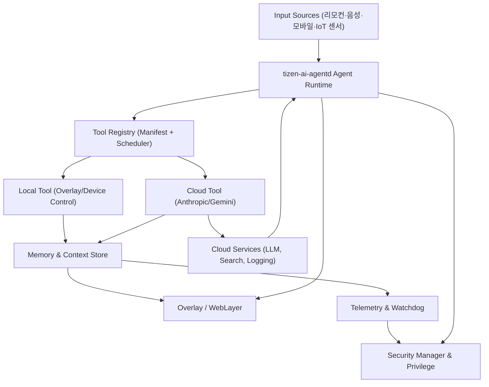
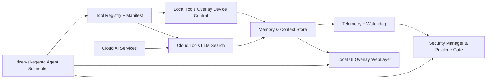

# Tizen AI-OS PRD

## 1. 개요 & 배경
* **배경**: Tizen TV는 기존 UI/OS 체계는 안정적이나 에이전트 기반 상호작용/콘텍스트 추적이 부족합니다. OpenClaw의 agent+tool+memory 구조를 가져와서 Tizen을 AI-native 플랫폼으로 재정의합니다.
* **목표**: 에이전트가 TV(리모컨·음성·캔버스·IoT 기기 포함) 전반을 감지하고 조치하며, Tizen의 시스템 서비스/권한 구조에서 자체 에이전트를 실행하는 **AI-OS**를 구현합니다.
* **참고**: OpenClaw PRD와 Claude Cowork(멀티툴 워크플로 + skill/heartbeat)에 기반해 native 영역에 맞춘 agent framework를 설계합니다.

## 1.1 Context & Problem Framing

* **입력 환경**: 리모컨, 음성, 모바일 앱, IoT 센서 등 다중 모달 입력이 혼재하며 SoC 성능과 전력 예산이 타이트합니다.
* **제약 사항**: Tizen TV에는 권한/보안 정책이 다양하고 OTA 업데이트 주기와 리소스 제한 때문에 거대한 런타임을 올릴 수 없습니다.
* **기회**: 하지만 TV는 거실 중심 허브에 들어앉은 사용자의 시청/홈 자동화 데이터를 모아두고, 이를 agent가 유연한 workflow로 분해·실행하면 차별화된 UX/브랜드 경험을 만들 수 있습니다.
* **경쟁 대비**: Apple Vision Pro나 Google TV가 제공하는 ‘공간적 에이전시’와 달리, Tizen AI-OS는 리모컨/음성/IoT 경계에서의 현실적 도구 통합과 로컬-클라우드 하이브리드 보안을 핵심 차별점으로 삼습니다.

이러한 컨텍스트에서 AI-OS는 ‘에이전트 네트워크 + tool manifest + memory service’의 조합으로 시장에서 검증된 워크플로를 Tizen에 접목하는 것이 핵심 방향입니다.

## 1.2 Architecture Blueprint

### 핵심 레이어
1. **Agent Runtime (tizen-ai-agentd)** - heartbeat scheduler가 agent를 주기적으로 트리거하고, 각 agent는 tool manifest에 따라 필요한 tool chain을 호출합니다. TV system service(Privilege Manager, Security Manager)와 tight 통합하여 허가된 액세스만 실행합니다.
2. **Tool Registry Layer** - JSON manifest로 정의된 tool마다 `type`, `inputs`, `outputs`, `security`를 명시하고, `heartbeat`/`quota`를 트래킹합니다. 로컬 tool은 Tizen service API(Overlay, Device Control)를 감싼 wrapper이고, cloud tool은 Anthropic/Gemini 기반 inference + search를 포함합니다.
3. **Memory + Context Layer** - 사용자 프리퍼런스/최근 시청 로그를 SQLite+vector embedding store에 담고, encryption keys는 Tizen Vault에 보관합니다. short-term context는 crontab-like heartbeat snapshots에 의해 GOP 단위로 갱신됩니다.
4. **Communication & Control Plane** - local overlay(WebLayer) -> agent -> tool 결과 -> overlay response로 이어지는 피드백 루프. 클라우드 모델 호출 시에는 transport layer security + rate limiting을 적용하고, `taoctl` CLI로 개발자 디버그가 가능합니다.

### 데이터/제어 흐름
``
[Input event] -> [tizen-ai-agentd heartbeat] -> [Agent planner (tool graph)] -> [Tool execution (local/cloud)] -> [Memory store update + telemetry log] -> [Overlay/UI response]
``
Telemetry는 agent success/failure, tool latency, heartbeats per minute을 로깅해 Tizen watchdog과 연동합니다. Prompt injection/_fallback policy는 tool 단계마다 `security` 메타에서 체크하며, 실패 시 사용자 확인(prompt)과 관리자 audit 로그를 동시에 만듭니다.

## 2. 비전 & Success Criteria
| 항목 | 목표 |
| --- | --- |
| 에이전트 신뢰성 | 에이전트 처리 실패율 < 1% (Tizen watchdog 기준) |
| 사용자 셋업 | 자주 묻는 질문/조작 중 60% 이상을 AI-에이전트가 직접 해결 |
| 사용자 수용 | 에이전트 행동에 대한 사용자 승인율 75% 이상 |
| 성능 | 메모리/CPU 예산을 기존 Tizen 서비스 대비 15% 이내로 유지 |

## 3. 사용자 & 사용 사례
1. **일반 사용자**: 방송 중 주변 기기 컨텍스트, 스케줄, 퀵 액션을 에이전트가 자동화. 리모컨/음성 → 자연어/액션 → 오버레이 응답.
2. **B2B (숙박·교육)**: AI OS 정책/매크로 모드, 중앙 Admin Console을 통한 skill 배포 및 행위감사.
3. **플랫폼 개발자/파트너**: Tizen agent SDK(OpenClaw tool manifest, memory API) + CLI(`taoctl`)을 이용한 tool 정의 및 테스트.

## 4. Feature Inventory
* **Agent Framework**: OpenClaw 스타일 heartbeat scheduling, agent orchestration, Tizen daemon `tizen-ai-agentd`.
* **Tools**: Input (리모컨/음성), Display Overlay, Device Control (IR/Bluetooth), Cloud Search, Calendar/Reminder, Content Recommender – 각각 Tizen Service API wrapper.
* **Memory & Context**: 로컬 SQLite + vector embeddings(사용자 프리퍼런스 + 방송 메타). 보안 vault와 결합된 점.
* **Workflows**: 명령 → agent pipeline → tool 호출 → fallback + prompt injection 필터.
* **Security**: Tizen key attestation, sandboxed tools, heartbeat 모니터링.
* **Integrations**: Fathom-style 회의/미팅 데이터, OpenClaw cron-heartbeat analog.
* **Analytics**: agent success/failure, intent logs, tool latency, memory usage (OpenClaw memory tables 참고).

## 5. Architecture & Integration
* **Runtime**: `tizen-ai-agentd` 데몬이 heartbeat 기반 agent 시작.
* **Tools Registry**: JSON manifest + `tizen-ai-tools/` (Tizen service wrappers, security policy metadata).
* **Memory Backend**: SQLite/embedded DB + embedding vectors per profile. Sync to secure cloud with hashed keys.
* **Communication Layers**: Local overlay(WebLayer), remote AI (Anthropic/Gemini via secure microservice), developer CLI (`taoctl`).

## 5.1 System Architecture Diagram

**설명:** 이 다이어그램은 입력 → 에이전트 → 툴 → 메모리/오버레이 → 텔레메트리 흐름을 보여줍니다. Agent Runtime은 heartbeat로 동작하며, Tool Registry가 로컬/클라우드 조합을 선택한 뒤 메모리에 결과를 기록합니다. Overlay와 Telemetry는 실시간 피드백을 제공하고 Security Manager가 모든 호출을 감시하여 Tizen privilege 정책을 적용합니다.

### 시스템의 핵심 키 피쳐
* **Heartbeat-driven orchestration** – Agent Runtime이 각 agent를 predictable한 간격으로 트리거하고, 실패 시 fallback heartbeat를 재실행합니다.
* **Tool manifest 기반 routing** – JSON metadata로 tool을 선언하여 local/cloud mix를 점검하고 rate limit/timeout을 적용합니다.
* **Memory + telemetry feedback** – 로컬 SQLite embedding store를 agent가 공유하고 Telemetry 엔진이 latency/success/failure를 기록하여 관리자와 watchdog이 관찰합니다.
* **Security-first integration** – Tizen Security Manager에 연결된 privilege profile로 action마다 권한을 확인하고, prompt injection 시 admin confirmation을 요구합니다.

## 5.2 Component Diagram

*Key components*
1. **Agent Runtime (tizen-ai-agentd)** – Heartbeat 기반 scheduler로, context에 따라 multi-step tool planner를 호출합니다.
2. **Tool Registry** – 모든 tool 메타를 보관하는 서비스. 각 manifest에는 `inputs`, `outputs`, `security`, `heartbeat`, `timeout`이 정의됩니다.
3. **Local & Cloud Tools** – Local은 Tizen Service API를 감싸고, Cloud는 LLM/search inference나 telemetry storage를 담당합니다.
4. **Memory & Telemetry Stack** – Vector embeddings/short-term context 저장소와 telemetry collector가 agent logs, tool latency, action outcome을 환경에 전달합니다.
5. **Overlay & Security Plane** – WebLayer 기반 응답 UI와 Tizen OS 보안 매니저가 action consent, opt-in 설정, audit trail을 관리합니다.
6. **Cloud AI Services** – Anthropic/Gemini 등 외부 모델은 `ToolCloud`를 통해 호출되며, rate limit policy와 encryption transport를 따릅니다.
## 6. Implementation Roadmap
1. **Phase 0 – Foundation (1m)**: Heartbeat scheduler, agent scaffold, logging, overlay prototype.
2. **Phase 1 – Skill Parity (2m)**: OpenClaw tools 포팅(Input, Content Search, Device Control), memory store + tool registry, security gating.
3. **Phase 2 – AI Collaboration (3m)**: Claude/OpenClaw multi-hop planning 서비스, partner console for reviewing logs/actions.
4. **Phase 3 – Productization (2m)**: Performance tuning, OTA QA (Tizen emulator + real hardware), autop-run scheduling.
5. **Phase 4 – Launch & Iterate**: Gradual rollout, usage telemetry, new skills (Home IoT, remote kiosk macros).

## 7. Risks & Mitigations
* **리소스 제약**: CPU/메모리 부족. → heartbeat throttling, queued tool calls, 캐싱.
* **보안/프라이버시**: 음성/콘텐츠 민감. → security manager 통합, encrypted memory store, opt-in gating.
* **신뢰성**: 잘못된 스마트 조치. → action confirmation, audit logs, revert tool, admin override.

## 8. 다음 단계
* Tool manifest + Tizen service API contract 정의 (`artifacts/tizen-ai-os-prd/agents/tool-manifest.md`).
* GitHub Pages로 PRD/연구 문서 공개, 파트너 피드백 루프.
* PoC agent module 빌드 → `artifacts/tizen-ai-os-prd/research`에 결과 수집.
